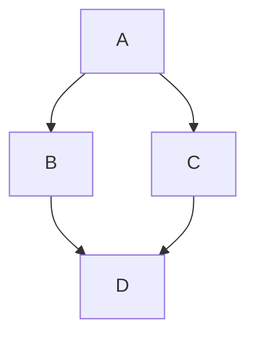
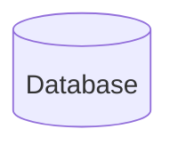

# Flow charts/Diagrams

Using charts, flow diagrams etc
[Mermaid](http://mermaid.js.org/syntax/flowchart.html)

Maybe we can use this somewhere.

!!! tip "PID Tuning"
    === "NO Filtering"
        
:::caution help :::

    === "Filtering is working"
        This is an orange

!!! warning
    |P|I|D|O|B|FF|
    |-|-|-|-|-|--|
    |2|4|5|6|9| 8|

!!! tip "Use tabs in admonitions"
    === "Apple"
        This is an apple 🍎

    === "Orange"
        This is an orange 🍊

    === "Banana"
        This is a banana 🍌

