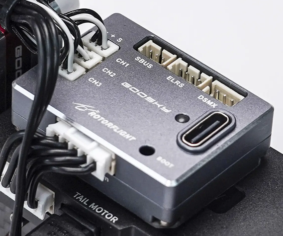
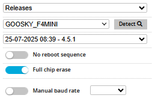
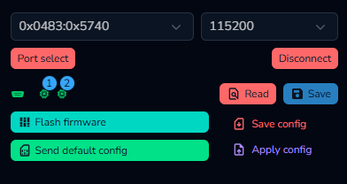

# Goosky F4-mini



:::info[Specifications]
### Goosky F4-mini Flight Controller

* MCU: STM32F405
* IMU: ICM-42688-P
* Blackbox: 128 MB W25N01G
* Three UARTs: UART1 (ELRS/DSMX), UART2 (SBUS), UART5 (ESC Telemetry)
* Three servo ports (micro JST 1.25mm, Molex PicoBlade compatible)
* Dedicated 3-pin SBUS port and 4-pin ELRS port (1.25mm micro JST)
* DSMX port (3-pin JST-ZH)
* ESC connector for 7.4V, telemetry, main and tail motor (5-pin JST-PH)
* USB-C for configuration
* Dimensions: 24 x 33 x 9 mm
* Weight: 12 g

### Goosky 3S F421 2-in-1 ESC

* MCUs: two AT32F421
* Dshot RPM telemetry for both main and tail motors
* BLHeli32/KISS telemetry providing real-time voltage, current, and temperature data
* Official AM32 target support
:::

### Rotorflight Target

Please use the GOOSKY\_F4MINI target when updating Rotorflight firmware.



# Update Procedure for the S2 Max

:::note
This update procedure applies to the S2 Max. Once the S2 Ultra tune is ready, we’ll update this page with instructions on how to upgrade your Ultra.
:::

The F4-mini is a plug-and-play replacement for the stock S2 Max flight controller. Team Rotorflight has tuned the F4-mini for the S2 Max. However, before you can apply this tune, you'll need to update the firmware on the F4-mini and the stock Goosky ESC. Here's how you can update.

## 1. Update the F4-mini Firmware

1. Start *Rotorflight Configurator*
2. Connect the F4-mini using USB
3. Click on *Update Firmware* in the upper right corner
4. Select the *GOOSKY\_F4MINI* board in the dropdown
5. Enable *Full chip erase*
6. Click *Load Firmware \[Online]*
7. Click *Flash Firmware*
8. Wait till it finished flashing. If everything went well, it should display *Programming SUCCESSFUL*.

Now that the firmware has been updated, you can configure it.

## 2. Configure the F4-mini for the S2 Max

The Rotorflight team has created two tunes for the S2 Max.

* S2 Max configuration for [Hard 3D](./configs/f4mini-s2-max-hard.txt): tune suitable for hard 3D. RPMs for profile 1/2/3: 4000/5100/5500.
* S2 Max configuration for [Sport flying](./configs/f4mini-s2-max-sport.txt): very similar to the above tune, but with just one rate profile instead of three and slightly lower RPMs. RPMs for profile 1/2/3: 4000/4600/5100.

:::warning
Do not use these configurations if you haven't flashed the F4-mini as described above. The configuration expects certain default values which are only available after flashing the GOOSKY\_F4MINI board.
:::

Download the configuration you want (e.g. right click on it and select *Save link as*). Then proceed as follows:

1. Click on *Connect* in the upper right corner of the *Rotorflight Configurator*
2. Click on *CLI* tab, then on *Load file*
3. Select the configuration you just downloaded
4. Click on *Execute*
5. After the configuration has been loaded, a warning will be given: 'The accelerometer is enabled but is not calibrated'. Click *Close*.
6. Go to the *Setup* tab and click on *Calibrate Accelerometer*
7. Go to the *Servos* tab and [adjust servo centers](/docs/setup/setup-servos#step-3---set-arms-at-90-degrees).
8. Go to the *Mixer* tab and [check the *Collective trim*](/docs/setup/setup-mixer#level-the-swashplate-and-blade-pitch-to-zero)
9. On the *Rates* tab, configure the [rates](/docs/configurator/tabs/rates) to your liking.
10. On the *Modes* tab, configure the [modes](/docs/configurator/tabs/modes) so that they work with your transmitter.
11. On the *Adjustments* tab, configure the [adjustments](/docs/configurator/tabs/adjustments) so that they work with your transmitter.

## 3. Update the ESC Firmware

1. Download [AM32\_GOOSKY\_3S\_F421\_2.19.hex](https://github.com/am32-firmware/AM32/releases/download/v2.19/AM32_GOOSKY_3S_F421_2.19.hex)
2. Power up the S2 Max
3. Connect the F4-mini using USB
4. Make sure *Rotorflight Configurator* isn't connected to the F4-mini. If it is, press *Disconnect*.
5. Go to https://am32.ca/configurator
6. Click on *Connect* in the upper right corner
7. Click on *Read*. The *AM32 Configurator* will now show various ESC settings, as well as some new buttons.\
   
8. Click *Flash firmware*
9. Go to the *Local* tab
10. Select *Ignore current mcu layout* if you flash the ESC for the first time
11. Click *Choose file* and select the `AM32_GOOSKY_3S_F421_2.19.hex` file you downloadeded
12. Click *Start flash*

## 4. Configure the ESCs

After both ESCs have been flashed, they can be configured. ESC 1 is the ESC for the main motor, while ESC 2 is for the tail motor. The ESCs have slightly different settings. For example, the main motor ESC is configured so that it won't brake on spool down, while the tail ESC uses complementary PWM for braking.

Start with configuring the main motor ESC.

1. Download [`s2-max-main-esc-config.bin`](./configs/s2-max-main-esc-config.bin)
2. Click on *Apply config*
3. Click *Choose file* and select the file `s2-max-main-esc-config.bin` that you just downloaded
4. Only select ESC 1
5. Click *Apply*

Now configure the tail ESC.

1. Download [`s2-max-tail-esc-config.bin`](./configs/s2-max-tail-esc-config.bin)
2. Click on *Apply config*
3. Click *Choose file* and select the file `s2-max-tail-esc-config.bin`
4. Only select ESC 2
5. Click *Apply*
6. Click *Disconnect*
7. Power down the S2

That's it! Now check and test everything carefully and go fly your S2. It's a seriously fun machine!

:::note[AM32 Configurator Bug]
The *AM32 Configurator* will only show the settings for ESC 1 under *Motors*, even if only ESC 2 is selected. That's a bug and means that you can't properly configure ESC 2 using the *AM32 Configurator* UI.

If you're using Windows, you can use the [AM32 Config Tool v1.93](https://github.com/am32-firmware/ConfigTool_1.90/releases/tag/v1.93) for configuring both ESCs.

If you don't use Windows, you can configure Rotorflight so that it only exposes the tail ESC. In *Rotorflight Configurator*, go to the *CLI* tab and type:

```
resource MOTOR 1 A08
resource MOTOR 2 NONE
save

```

Now you can configure the tail ESC in *AM32 Configurator*. When you're done, restore the original settings with:

```
resource MOTOR 1 C08   # main motor
resource MOTOR 2 A08   # tail motor
save
```
:::
