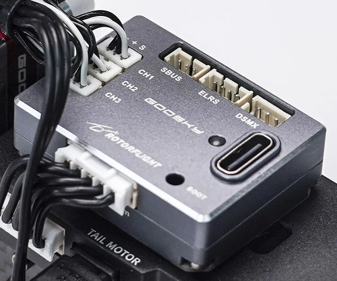
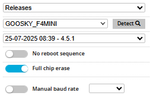

# Goosky F4-mini

Goosky's purpose-built answer for S2 Max and Ultra pilots who demand more. This compact flight controller packs genuine Rotorflight processing into a micro-heli form factor — because your small bird deserves big-heli tech. 

:::info[Specifications]
### Goosky F4-mini Flight Controller

* STM32F405 MCU paired with an ICM-42688-P IMU
* W25N01G 128MB blackbox for detailed flight logging
* Three servo ports (micro JST 1.25mm, Molex PicoBlade compatible)
* Three UARTs: UART1 (ELRS/DSMX), UART2 (SBUS), UART5 (ESC Telemetry)
* Dedicated 3-pin SBUS port and 4-pin ELRS port (1.25mm micro JST)
* DSMX port (3-pin JST-ZH)
* ESC connector for power (7.4V when using the Goosky 3S F421 ESC), telemetry, main and tail motor (5-pin JST-PH)
* USB-C for hassle-free configuration
* Precision CNC'd aluminum housing (24 x 33 x 9mm) that's built to last
* Weight: 12 g
* Input voltage: 5-16V
* Drop-in replacement for the stock S2 Max flight controller

### Goosky 3S F421 2-in-1 ESC

* MCUs: two AT32F421
* Dshot RPM telemetry for both main and tail motors
* BLHeli32/KISS telemetry providing real-time voltage, current, and temperature data
* Official AM32 target support
:::

### Rotorflight Target

Please use the GOOSKY\_F4MINI target when updating Rotorflight firmware.

