# Flyrotor Governor setup

## ESC Configurator

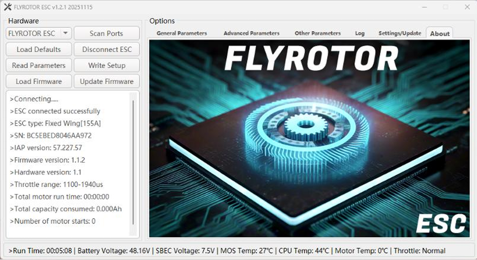

The latest FlyRotor ESC Configurator for Windows is available here:\
https://github.com/Jiki-Mo/ESC-Configurator/

As of 11/16/2025, version 1.2.1 is the latest.

Latest FlyRotor ESC Firmware Versions:

* FlyRotor 150a – 1.2.1
* FlyRotor 280a – 1.1.1

FlyRotor ESC’s have one of the fastest updating ESC telemetry systems in the world. This works extremely well combined with Rotorflight’s Blackbox for flight history and troubleshooting.

FlyRotor ESC Telemetry Rate: 100 Hz

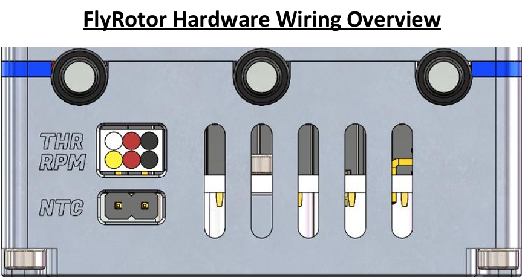

FlyRotor Hardware Wiring Overview.

* **THR:** Wh/Red/Blk: Electronic throttle cable, which supports PWM input from 20–480 Hz and has default throttle values of 1100–1940 µs.
* **RPM:** Yel/Red/Blk: ESC RPM sensor signal line.
* **NTC:** External temperature sensor port, used to detect ambient or motor temperature.

!!! note
    This is an accessory for the ESC and the port does not have polarity. It can be plugged in either way.

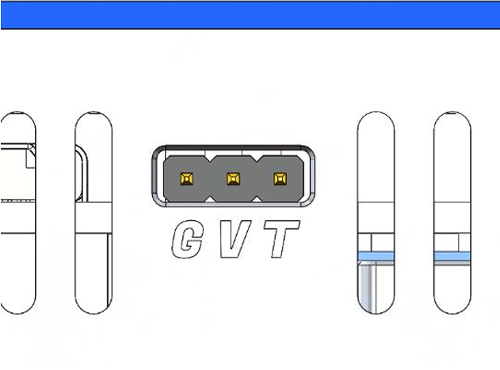

* This port is for powering the ESC cooling fan and for ESC telemetry communication.
* **G:** GND, **V:** Fan positive terminal, **T:** Telemetry or programming.

!!! note
    The T pin should be wired to a Rotorflight UART TX pin.

* If you are wired to a UART RX pin (e.g. RF007/TLM port) then “Rx/Tx Pin Swap” should be enabled under **Motors → ESC-Motors** tab.
* You also need to enable “one-wire communication half-duplex” to allow bidirectional communication between the FBL and ESC. This is required for Forward Programming from Rotorflight to FlyRotor ESC.

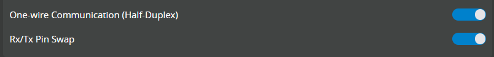

* This USB port is the communication port between the ESC and the computer, and it supports USB 2.0 and C-to-C cables. This is required when using the FlyRotor Configurator app to make settings changes or firmware updates.

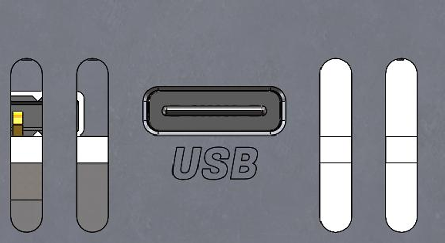

## FlyRotor ESC Configurator – Order of Operations

!!! note
    As of FlyRotor Configurator v1.2.1, the application will automatically read ESC parameters upon successful connection. Prior to v1.2.1, you needed to manually click “Read Parameters” after a successful connection.

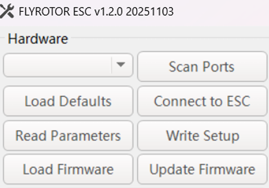

1. Scan Ports
2. Connect to ESC
3. Read Parameters (if using app \< 1.2.0)
4. Make changes in setup tabs
5. Write Setup
6. Done!

## FlyRotor ESC Configurator – Basic Setup

* Change ESC Mode to **RF Gyro Governor** when using Rotorflight Mode1 Governor.
* FlyRotor ESC uses the concept of **electrical angle**, which differs from the “advance angle/motor timing” of other ESCs. The default automatic mode is geared towards high performance.
* If you want a smoother ride, or to fine-tune the motor to its optimal drive state (for non-standard motors), you can select a suitable fixed electrical angle value, which supports 1–10 degrees.
* If the motor temperature is high during flight, please increase this value.
* It is recommended to use the automatic mode, which will dynamically adjust the electrical angle value based on the current speed of the motor and the temperature value of the ESC.

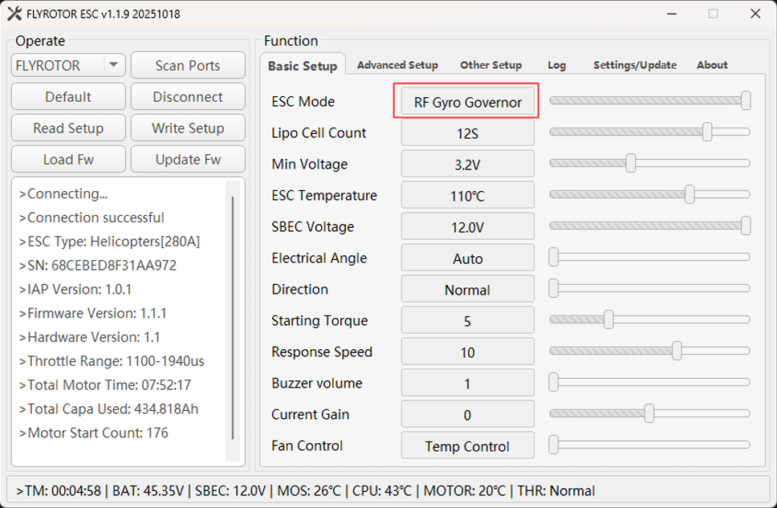

* For **RF Gyro Governor** or **Linear Throttle** ESC modes: the **Starting Torque** setting can be lowered if experiencing a tail whip/kick symptom upon motor spool-up.
* The default value is 5. If the starting force is too high, it is recommended to decrease this value to 2 and retest.

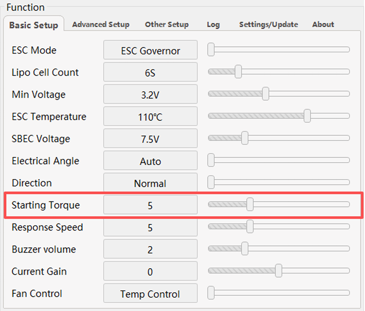

## FlyRotor ESC Configurator – Advanced Setup

* Gov P/I only apply when using the FlyRotor internal governor.
* **Drive Frequency** should be left at 16 kHz for helicopters with 40, 42, 45, 47, 50 pole brushless outrunner motors.
* **Motor ERPM Max** is required for **RF Gyro Governor** or **FlyRotor Governor** ESC modes.
* The Voltage/KV/Poles settings must be entered to calculate this value.
* You must use the **Speed Calculator** to determine if your target RPM is feasible and/or throttle value % is sufficient for governor functions.
* Recommended throttle is 75–85% with 15–25% reserved for governor authority.

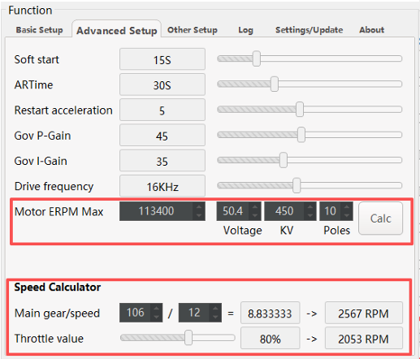

## FlyRotor ESC Configurator – Other

* Choose **RF FLYROTOR** when integrating with Rotorflight for ESC telemetry protocol.

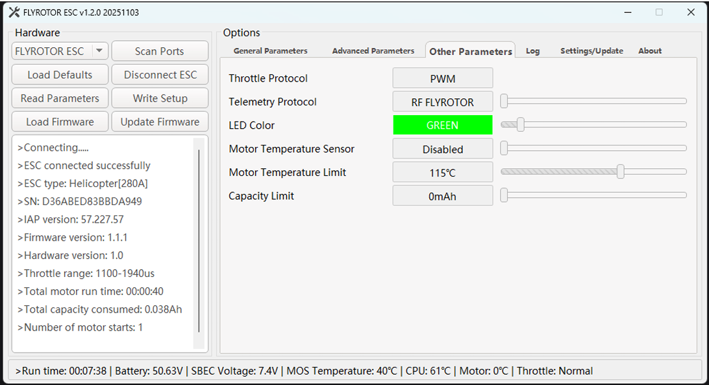

“TBS – CRSF” telemetry protocol was added for the following use cases:

* Using an ELRS receiver to fly a helicopter where the flight controller is not Rotorflight.
* Using an ELRS receiver to fly a fixed-wing aircraft or other model aircraft.

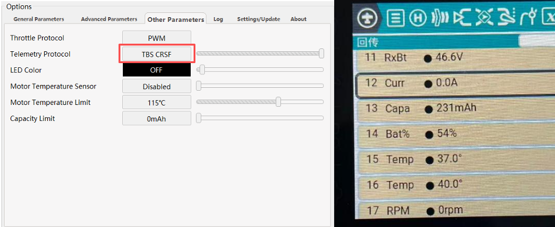

## FlyRotor ESC Configurator – Logging

* Shows logging values from previous ESC flights as well as alarms or events that may be of interest.

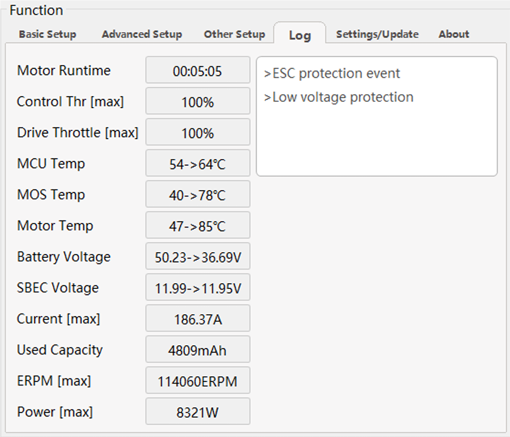

## FlyRotor ESC Configurator – Settings/Update

* Use this tab to check for ESC firmware and Configurator version updates.

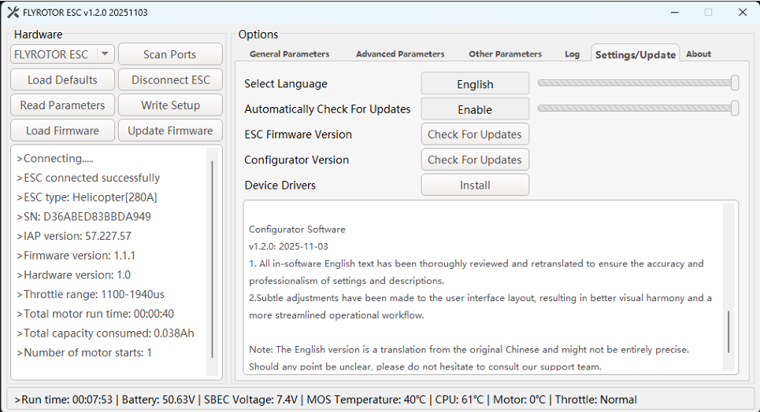

## Calibrating FlyRotor throttle endpoints using Rotorflight – Motor Override

* The default PWM throttle values for FlyRotor ESCs are:
* 0%: 1100 µs
* 100%: 1940 µs

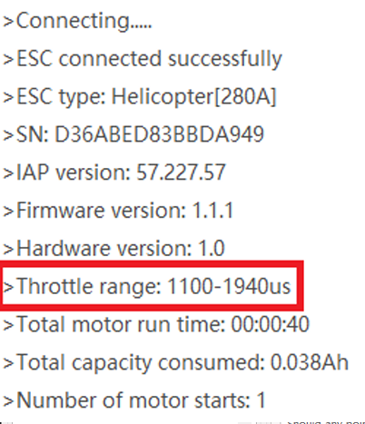

* You should update these values in the Rotorflight **Motors** tab for 0% and 100% throttle PWM values to match FlyRotor defaults (1100/1940 µs).

Note: This procedure is required only if you need to teach the FlyRotor ESC new throttle endpoints.

1. Remove main and tail blades from the helicopter (*safety first*).
2. Connect RF gyro to computer, start the Rotorflight Configurator, and go to the **Motors** tab.
3. Enable **Motor Override** and set to 100%.
4. Connect battery to FlyRotor ESC and wait for multiple beep tones to confirm.
5. Lower throttle to 0% in Motor Override and wait for beep confirmation.
6. Disable Motor Override.

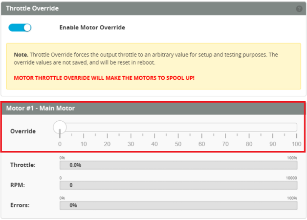

## FlyRotor ESC – Motor temperature sensor feature overview

* Within the FlyRotor Configurator, you must **Enable** Motor Temperature Sensor (default is **Disabled**).

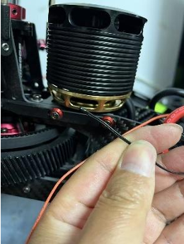

* You should adjust the Motor Temperature Limit between 90–125 °C. When this limit is reached, the ESC will limit throttle output to 50% to prevent overheating.
* Note: Most copper motor wire insulation will start to burn at around 150 °C.

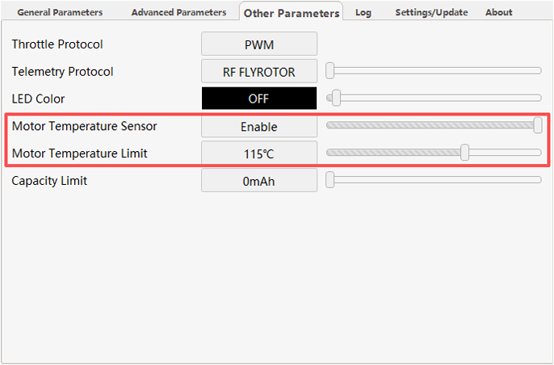

* The optimal location for the temperature sensor is depicted below.

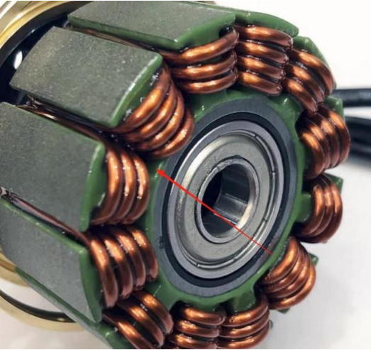

* Use a high-temperature, thermally conductive adhesive to secure the thermistor and prevent it from moving during flight. For example, **Kafuter K-5204K**.

Example picture: Motor temp sensor installed in Goosky RS5 helicopter.

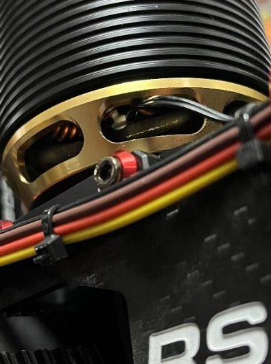

## FlyRotor ESC – Battery capacity limit feature overview

* This feature is intended for setups without telemetry support.
* When the ESC reaches the programmed capacity limit, it automatically reduces throttle output to 50% as a safety measure to protect the battery.
* This feature is activated when a non-zero value is entered in **Capacity Limit**.

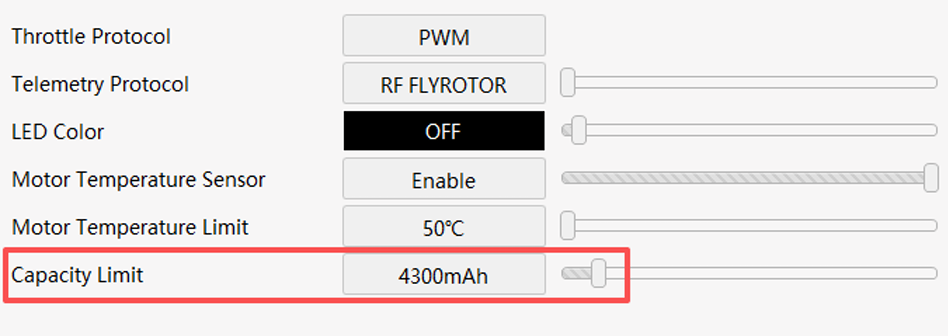

These settings were taken from a 700-class RC helicopter and are provided as an example. You may need to adjust them to suit your specific setup.

## Rotorflight Profile – PIDs

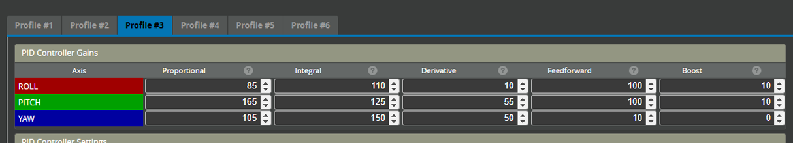

## Rotorflight Profile – Tail rotor settings

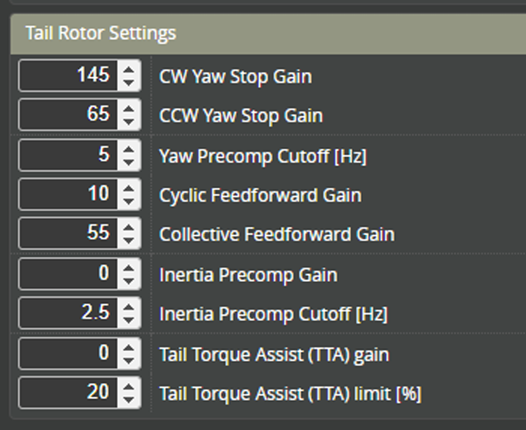

## Rotorflight Profile – Governor settings

* If the RF Gov PID Master Gain or P-gain is too high, the head speed will oscillate or surge.
* If the P-gain is too low, the system will bog or droop under load.

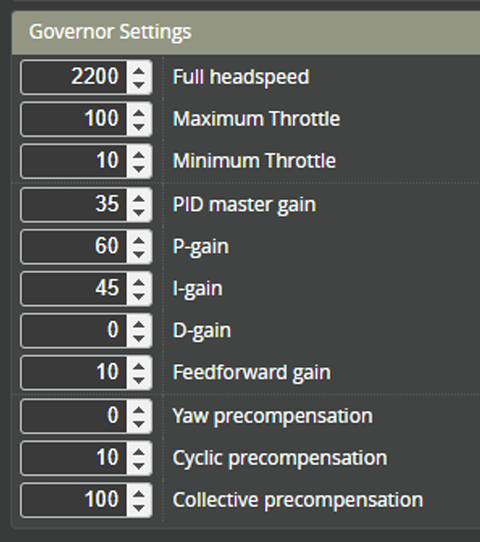

## Rotorflight Motor tab – Governor features

* Change the **Governor Handover Throttle** from 20% to 10%.

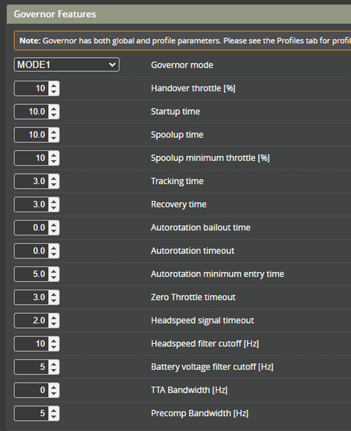

## Rotorflight – Receiver – Telemetry sensors

* For FlyRotor 155A / 280A ESCs (150A is not supported), a thermistor is provided to directly measure the motor temperature.
* You need to enable **ESC Temp 2** to pass this to the radio telemetry link.
* The radio-side telemetry item will show as **BecT**.

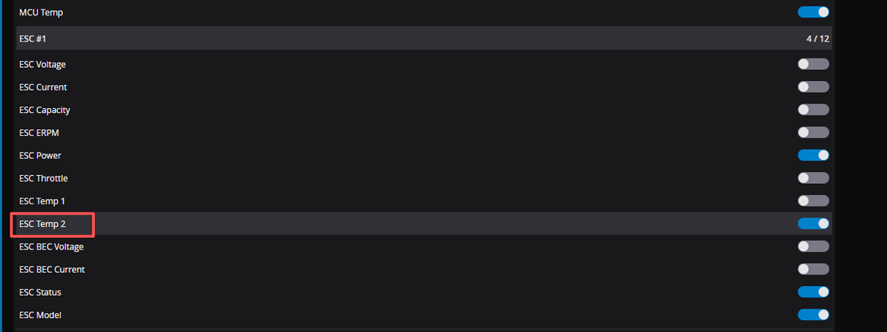

