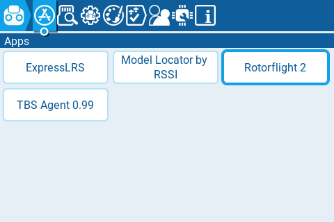
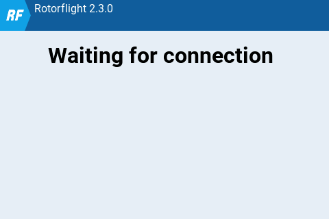
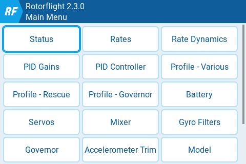
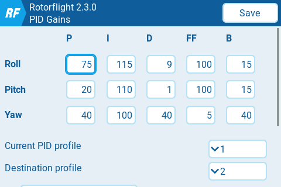
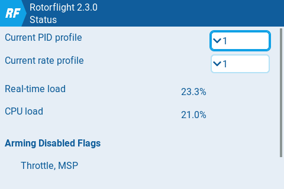
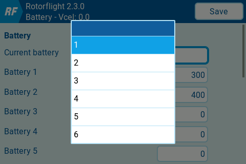
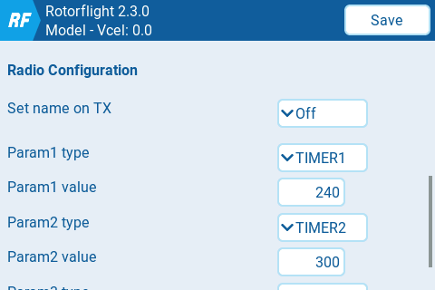
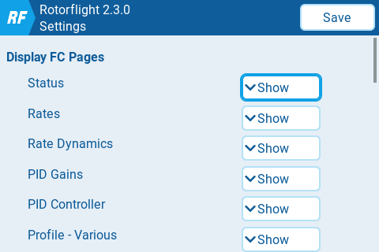

import Tabs from '@theme/Tabs';
import TabItem from '@theme/TabItem';
import tabStyles from '../tabs.module.css';

import EdgeTX from './img/edgetx-logo.png';
import ETHOS from './img/ethos-logo.png';

# Lua Scripts

## Introduction

You can configure the system directly from your transmitter using the Rotorflight Lua scripts. Once installed, the scripts add dedicated pages to the transmitter UI, providing access to parameters such as PID tuning, rates, filters, servo settings, and governed head speed—without needing a computer at the field.

Prerequisites:

* OpenTX 2.3.12, EdgeTX 2.5.0 or newer or Ethos 1.4 or newer on the transmitter and:
  * an FrSky SmartPort or F.Port receiver.
  * or a CRSF v2.11 or newer receiver.
  * or an ELRS 3.5.0 or newer receiver.

Examples:

* TX16S with a FrSky X4R using the [FrSkyX2](https://github.com/pascallanger/DIY-Multiprotocol-TX-Module/blob/master/Protocols_Details.md#frskyx2---64) protocol.
* Frsky Ethos Radio (X20, X18, X14 etc) with either SPORT,FPORT receiver or ELRS with an external module.
* Taranis X9D with a TBS Crossfire TX/RX module.
* Taranis QX7 and a FrSky R-XSR, using the FrSky D16 protocol (as long as you don't use the ACCST D16 2.1.1 LBT firmware on the R-XSR, because this firmware has telemetry bugs).
* TX16S with an ELRS 3.5.0 module and receiver.

If you're not using F.Port, start up the *Rotorflight Configurator*, go to the *Configuration* tab and enable the *TELEMETRY* feature. F.Port telemetry does not work without enabling this feature.

If telemetry is working properly on your system, the Lua scripts should work as well.

There are different Lua scripts depending on what radio you are using (edgeTX or Ethos).

:::info[Please choose to suit your Radio - EdgeTX or ETHOS]
<Tabs groupId="operating-systems">
  <TabItem value="" label="Choose Tx" default attributes={{className: tabStyles.tab}}>
    Rotorflight has great support for both EdgeTX and Ethos.  Please choose your radio.
  </TabItem>

  <TabItem value="EdgeTX" label="EdgeTX" attributes={{className: tabStyles.tab}}>
    ## EdgeTX

    

    ### OpenTX/EdgeTX Installation

    Download the [latest release](https://github.com/rotorflight/rotorflight-lua-scripts/releases) and copy the contents of the `SCRIPTS` folder to your transmitter. See also the [README](https://github.com/rotorflight/rotorflight-lua-scripts#installation).

    You will know if you did this correctly if the `rf2.lua` file shows up in the `/SCRIPTS/TOOLS` directory. Also *Rotorflight 2* should now show up in the *Tools* menu of your transmitter.

    ### Usage

    On your transmitter, go to the *Tools* menu of your transmitter and select *Rotorflight 2*.

    

    The first time you do this all scripts will be compiled and the *Tools* menu will be displayed again. Select *Rotorflight 2* again. Now the script will wait for a connection with the receiver.

    

    Power up the receiver. The script will retrieve the Rotorflight version. After this you will see the main menu. If you don't, make sure you've discovered all telemetry sensors.

    

    In the main menu you can select what you want to see or change. For example, after selecting *PID Gains* you'll see a page displaying the PIDs for the currently selected profile:

    

    Feel free to have a look at any page. As long as you don't select *Save*, nothing will be changed.
    
    ### Saving changes
    
    If you want to save your changes, press the *Save* button (color radios) or long press the wheel/roller and select *Save* (black and white radios). 

    ### Status Page

    The *Status* page displays any *Arming disabled flags*, which can be handy for troubleshooting why you can't start the heli. 
    
    

    ### Battery Page

    On the *Battery* Page you can define up to 6 battery profiles for your heli. These settings are stored on the flight controller of the heli, so each heli can have its own battery profiles. 
    
    On this page you can also specify the pack you're going to use for the next flight, so the battery capacity sensor will work correctly.

    

    ### Model Page

    On the *Model* page you can specify the duration of Timer 1/2/3, among other things. These settings are stored on the flight controller of the connected heli. This enables you to use one model on the transmitter for different helis, with each heli having its own timer settings.

    

    ### Settings Page

    On the *Settings* page you can specify which pages should be shown on the main menu. This allows you to hide unused pages.

    

    ### Background script
    The optional background script `rf2bg.lua` features *Real Time FC Clock synchronization*, the *Adjustment Teller* and *CRSF/ELRS custom telemetry*.
    - RTC synchronization will send the time of the transmitter to the flight controller. The script will beep if RTC synchronization has been completed. Blackbox logs and files created by the FC will now have the correct timestamp.
    - *CRSF/ELRS custom telemetry* enables all available Rotorflight telemetry sensors when using ELRS.
    - The *Adjustment Teller* will [tell you](https://www.youtube.com/watch?v=rbMiiWhzhqI) what adjustment you just made. It supports all adjustments except profile adjustments.

    There are two ways to run the background script:
    1. Either configure `rf2bg` to run as a special or global function in EdgeTX/OpenTX.
    2. Or configure the *RF Tool* widget. This only works on color radios running EdgeTX.

    ### 1. Run the background script as a function
    In OpenTX, configure your special function as follows to run the script automatically as soon as the model is selected ('ON').

    

    On EdgeTX, make also sure to set *Repeat* to *On*:

    

    ### 2. Or configure the *RF Tool* widget

    If you have a color radio running EdgeTX 2.11 or higher, then you can use the *RF Tool* widget that was released in Rotorflight 2.3.0. Running this widget has several benefits:
    - It will automatically show the name of the connected model.
    - *RF Tool* can also always display one sensor value of your liking. I like *Vcel* (cell voltage) to be displayed always, so I don't completely exhaust my batteries while tuning.
    - *RF Tool* defines an API that can also be used by other widgets, which makes programming Rotorflight widgets easier. The *RF Stats* widget for example uses the *RF Tool* API, and displays/updates flight statistics.
    - You don't need to configure a function for running the background script anymore.

    In the image below you can see the *RF Tool* widget in the upper left part, while the *RF Stats* widget sits in the lower right part of the screen.

    

    Here's a video that explains [how to set up the widget](https://www.youtube.com/watch?v=t72pQoBngGs).

    ## Adjustment Teller

    The *Adjustment Teller* can be enabled under Settings > Rf2bg Options > Adjustment Teller. The teller uses telemetry for getting the adjustment function and value:
    - S.port/F.port: the telemetry sensors 5110 and 5111 should be available. Discover or add them if they aren't.
    - RF 2.0 CRSF: the telemetry sensor FM should be available. Also do a `set crsf_flight_mode_reuse = ADJFUNC` in the CLI and `save`.
    - RF 2.1+ with CRSF/ELRS custom telemetry: make sure you include the *Adjustment Function* sensor.
  </TabItem>

  <TabItem value="ETHOS" label="ETHOS" attributes={{className: tabStyles.tab}}>
    ## ETHOS

    

    ### 1. Ethos Installation

    Download the [Latest Ethos Lua Suite release](https://github.com/rotorflight/rotorflight-lua-ethos-suite/releases) and save the zip file to your PC\laptop

    Open Frsky Ethos Suite and connect the USB-C cable, once connected, select Lua Development tools,

    

    Select, Install Lua Scripts and choose the zip file from the download above, select rfsuite and Install Lua Scripts. Close Ethos Suite

    

    ### Usage

    Disconnect the transmitter and power off\on. Enter the model page.

    

    Scroll to the end and you should see this LUA Icon

    

    Please ensure this is set to ON. Return to the Main Menu

    Press SYS key and scroll to the end page, the following should be shown.

    

    IMPORTANT: Changes will only be written to the eeprom when the aircraft is moved from Armed to Dis-armed, if you disconnect power when in an Armed state the changes will not be saved to eeprom.
    If installing for ELRS please see the separate section before returning to this section.

    Ensure the aircraft receiver and FBL are powered, Select the ICON above and you should see the following:

    

    In the example below of the PID's screen:

    PID's #1 - Will change depending on which profile you have your transmitter profile\bank switch set i.e. PID's #2, PID's #3 etc

    MENU - Will take you to the top level menu (Please ensure you have clicked SAVE before exiting)

    RELOAD - Will update the current page and read from the FC

    SAVE - Will write your changes to eeprom

    

    There is also a help screen (?) with useful information on tuning methods

    
  </TabItem>
</Tabs>
:::
