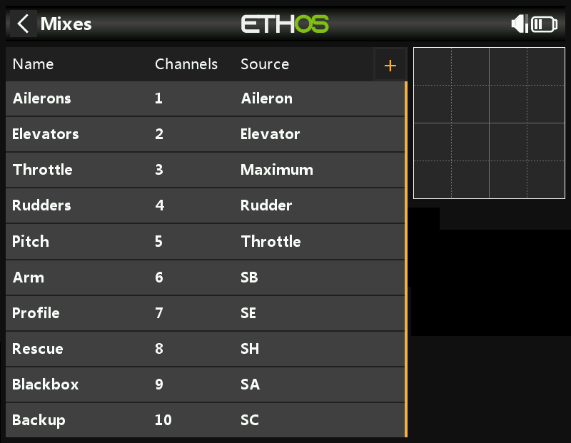

# ETHOS Generic Radio Setup

This walkthrough will guide you through to create a basic radio model for rotorflight controller.

This is a guide for ETHOS radios, it will work with both SBUS and F.port\FBUS receiver protocols.

The Channel order is AETRC123 which will work for SBUS, F.Port and FBUS.

For setup on ELRS receivers using external ELRS module with ETHOS please configure the channel order to AECR1T23 as required by ELRS

:::info[note]
The Rotorflight basic operation will require a minimum of 6 channels, but this is for basic operation only, additional channels will be required for other options, such as profile switching, Rescue, etc.

Normally you will need a total of 8 channels if you want to have options like *Profile switching* and *Rescue*.
:::

## Channels Arrangement

This following radio model uses 10 channels to get the best of Rotorflight options, the user can add or delete channels depending on his specific application, and required features.

These channels are configured as follows:

| Channel # | Function |
|--|--|
| CH1 | Aileron |
| CH2 | Elevator |
| CH3 | Throttle |
| CH4 | Rudder |
| CH5 | Collective |
| CH6 | AUX1 - Arming |
| CH7 | AUX2 - Profile Switching |
| CH8 | AUX3 - Rescue |
| CH9 | AUX4 - Blackbox |
| CH10 | AUX5 - Backup Pack|

:::caution[note]
When using SBUS only connection, you will not be able to use advanced features such as Lua forward programming or Telemetry.

* It is advised to use supported F.Port or FBUS receivers
:::

## Radio Setup

This [Generic Rotorflight Radio Model](./files/generic_rf.bin) BIN file contains all the options listed above.

### Radio Mixer Page Setup

Configure the inputs on the radio as per the below image.



Based on the image above:

The 3-position **SB** Switch will control *Arming* as below:

* Switch **SB**-*down*: Disarmed
* Switch **SB**-*middle*: Disarmed
* Switch **SB**-*up*: Armed

The 2-position **SF** Switch will control *Throttle Hold* as below:

* Switch **SF**-*down*: Throttle Hold
* Switch **SF**-*up*: Throttle Release

The 3-position **SE** Switch will control *Throttle percentage* and *Profile Switching* as below:

* Switch **SE**-*down*: Profile 1, and Rate 1
* Switch **SE**-*middle*: Profile 2, and Rate 2
* Switch **SE**-*up*: Profile 3, and Rate 2

The 2-position **SH** Momentary Switch will control *Rescue* as below:

* Switch **SH**-*down*: Rescue OFF
* Switch **SH**-*up*: Rescue ON

The 3-position **SA** Switch will control *Blackbox enable* and *Blackbox erase* as below:

* Switch **SA**-*down*: Blackbox Logging OFF
* Switch **SA**-*middle*: Blackbox Logging ON
* Switch **SA**-*up*: Erase Blackbox Logs

The 3-position **SC** Switch will control *Backup Buffer Pack* as below:

* Switch **SC**-*down*: Buffer OFF
* Switch **SC**-*middle*: Buffer ON
* Switch **SC**-*up*: Buffer ON

## Rotorflight Setup

After completing the above radio setup, you can proceed to the Rotorflight Configurator to complete the setup on the flight controller side.

### Arming Setup

Proceed to Modes Tab and setup arming as per below picture.


Alternatively you can paste and save the below commands in CLI to easily achieve the same result.

```
aux 0 0 0 1800 2100 0 0
```

### Profile Switching Setup

Proceed to Adjustment Tab and setup Profiles and rates switching as per below picture.


Alternatively in CLI.

```
adjfunc 0 2 1 900 2100 1 975 2025 975 2025 0 0 3
adjfunc 1 1 1 900 2100 1 975 2025 975 2025 0 0 3
```

### Rescue Setup

Proceed to Modes Tab and setup Rescue mode as per below picture.


Alternatively in CLI.

```
aux 1 53 2 1800 2100 0 0
```

### Blackbox Setup

Proceed to Modes Tab and setup Blackbox Modes as per below picture.


Alternatively in CLI.

```
aux 2 26 3 1400 1600 0 0
aux 3 31 3 1800 2100 0 0
```

### Buffer Pack Setup

Buffer packs like the [1st Buffer-Pack](https://1st-rc.com/en/product/1st-buffer-v4-3x25f-for-helis-450-700/) can be switched off from the radio after disconnecting the main pack, this can be done by connecting the buffer pack to a free 1500us PWM Channel on the flight controller.

* First you need to assign servo 5 to a free timer pin, you will then see servo 5 in the Servos Tab.
  Assuming we have a free timer on pin A08.

  In CLI:

  ```
  Resource Servo 5 A08
  ```
* Next you assign AUX5 Channel to Servo 5 using a mixer rule.

  In CLI:

  ```
  mixer rule 1 set AUX5 S5 1000 0
  ```
