# Flight Tuning

**Flight Tuning** holds the settings you change most at the field: PIDs,
rates, the governor and the rotor settings. The pages are the same settings
as the Configurator's, so each section below links to the page that explains
them.

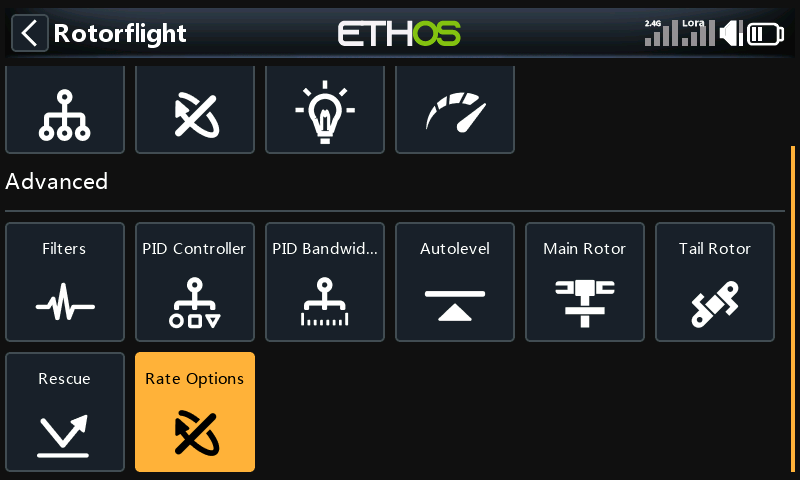

The menu scrolls: below **Advanced** there is a further row with **Rescue**
and **Rate Options**.

Most of these pages belong to a PID or rate profile, shown in the title as
_PIDs #1_ and so on. To work on another profile, switch to it (from the radio,
or with [Select Profile](./tools-and-logs.md#select-profile)) and the page
follows.

## PIDs

P, I, D, F, O and B for roll, pitch and yaw.

See [Profiles](../../../../configurator/tabs/profiles.mdx).

## Rates

RC Rate, Rate and RC Expo for roll, pitch, yaw and collective, for the active
rate profile. The column headings follow the rate type chosen under
[Rate Options → Rate Table](#rate-options).

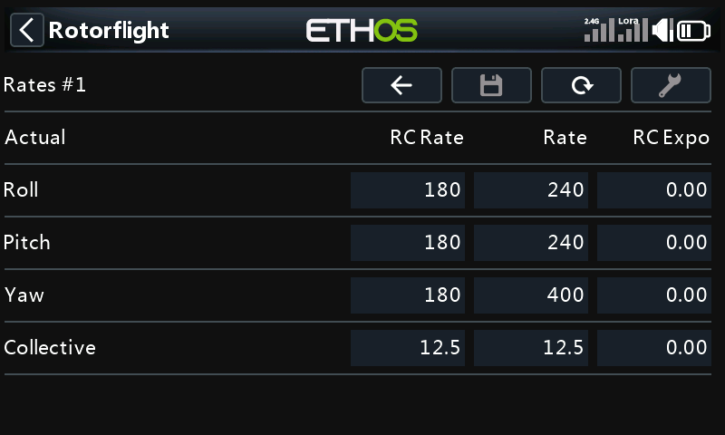

See [Rates](../../../../configurator/tabs/rates.mdx).

## Tune Advisor

Unlike the other pages, the Tune Advisor is the radio's own. While you fly in
rate mode, the flight controller measures how the model answers the sticks,
and each time you disarm the radio stores that flight's results. Pick an axis
to see how it responds and stops, and what the advisor suggests changing and
why. **Tool** clears the data it has collected.

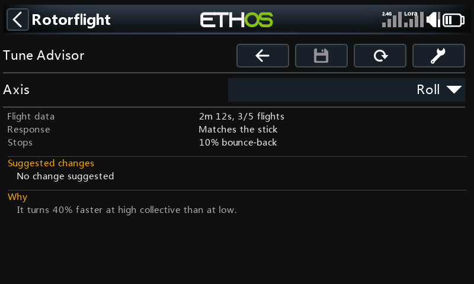

## Governor

The governor's per-profile settings, in two pages: **General** (head speed,
throttle limits, fallback drop and gains) and **Behaviour** (precomp,
spoolup, voltage compensation and dynamic minimum throttle). The governor's
mode and timing are under [Setup → Governor](./setup.md#governor).

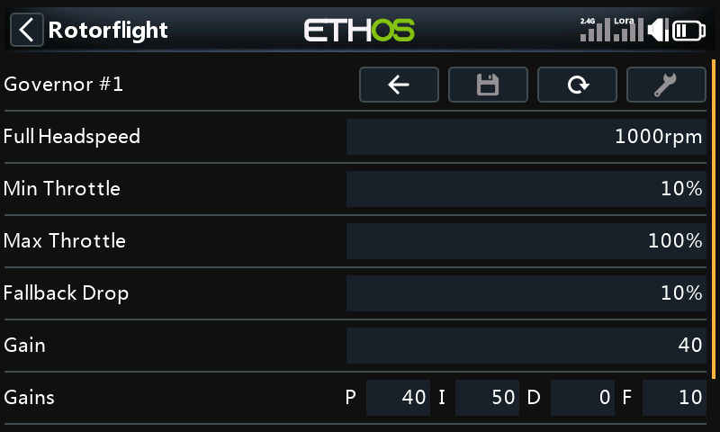

See [Governor](../../../../configurator/tabs/governor.mdx) and
[Tune Governor](../../../../Tuning/Tune-Governor.mdx).

## Filters

The gyro lowpass filters (type, cutoff, and dynamic range) and the notch
filters. The page scrolls.

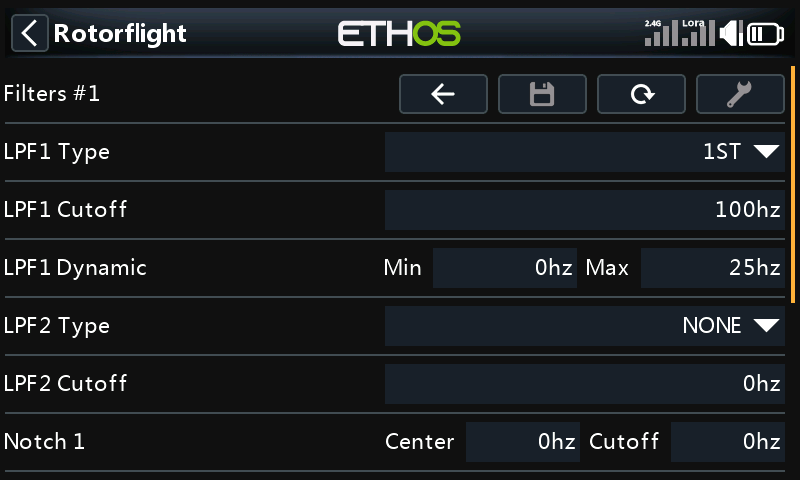

See [First Flight Filter Tuning](../../../../Tuning/First-Flight-Filter-Tuning.mdx).

## PID Controller

How the PID loop handles error: ground and in-flight error decay, error
limits, HSI offset limit and I-term relax. The page scrolls.

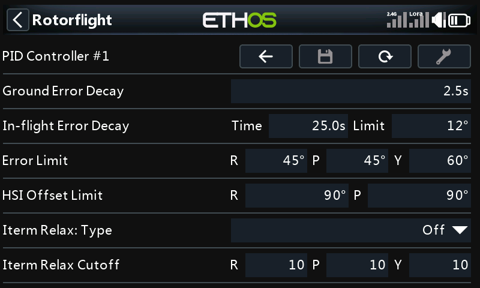

See [Profiles](../../../../configurator/tabs/profiles.mdx).

## PID Bandwidth

Cutoff frequencies for the gyro, D-term and B-term, per axis.

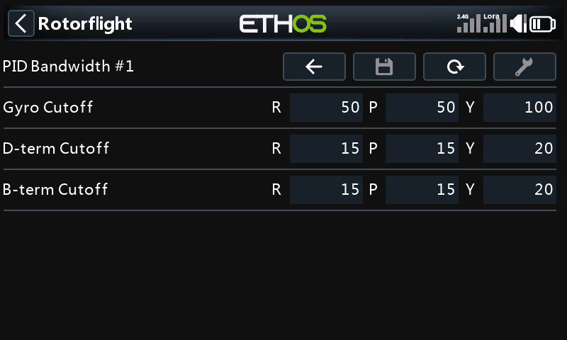

## Autolevel

Gain and maximum angle for Acro Trainer and Angle mode, and the Horizon mode
gain.

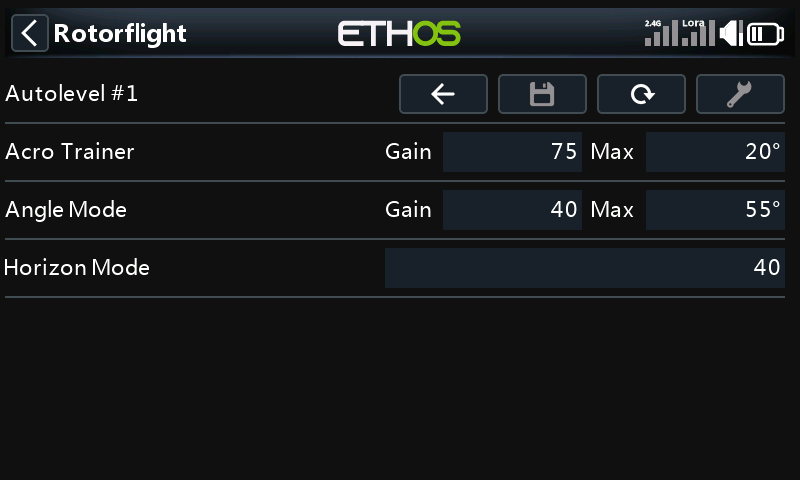

See [Modes](../../../../configurator/tabs/modes.mdx).

## Main Rotor

Collective pitch compensation and cyclic cross coupling.

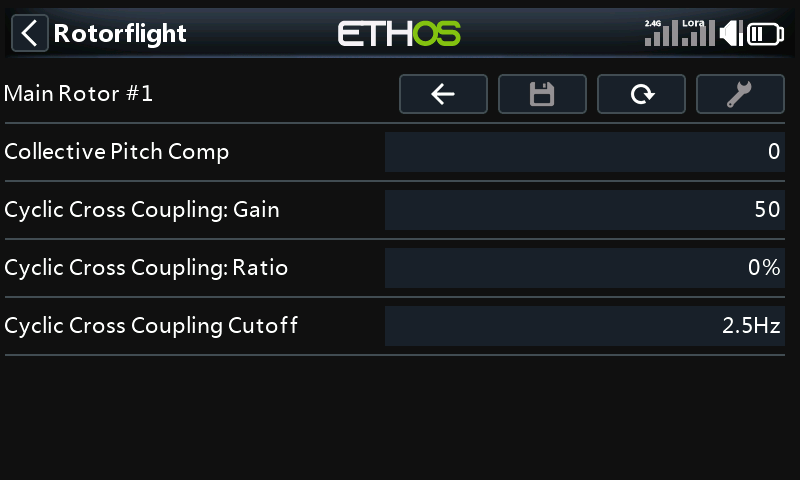

See [Cyclic Cross Coupling](../../../../Tuning/Cyclic-Cross-Coupling.mdx).

## Tail Rotor

Yaw stop gains, precomp, inertia precomp and tail torque assist.

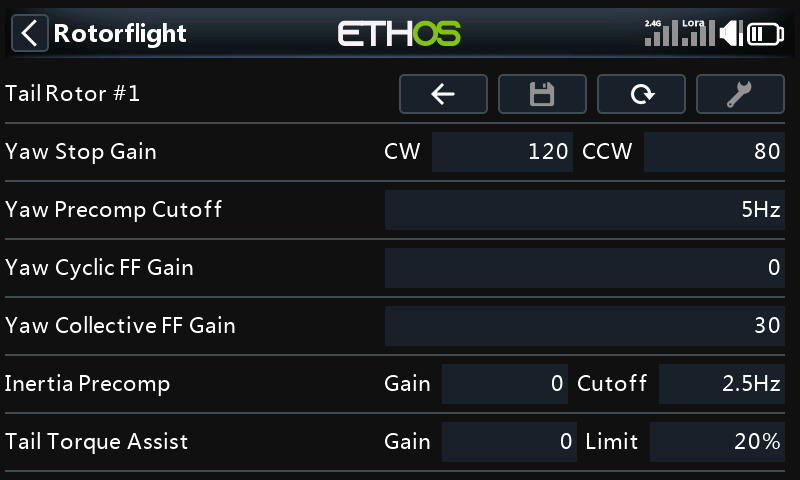

See [Motorised Tail and TTA](../../../../Tuning/Motorised-Tail-and-TTA.mdx).

## Rescue

Rescue mode: whether it flips to upright, and the pull-up, climb, hover and
flip stages. The page scrolls.

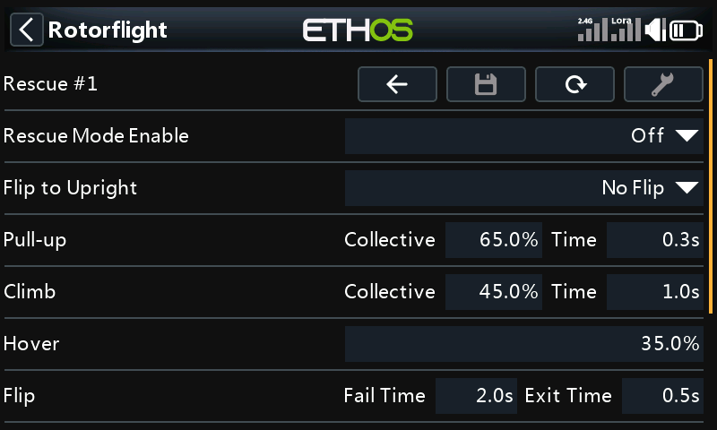

See [Rescue Mode Settings](../../../../Tuning/Rescue-mode-settings.mdx).

## Rate Options

A menu of three pages: **Advanced** (response time, acceleration limit,
setpoint boost and dynamic ceiling gain per axis), **Cyclic Behav.** (cyclic
ring and polarity) and **Rate Table** (the rate type the Rates page uses).

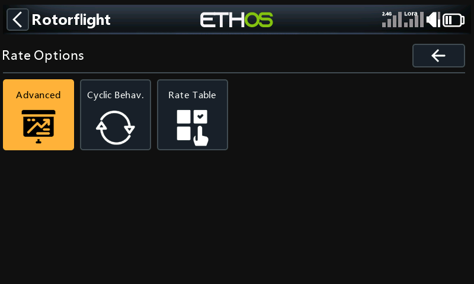

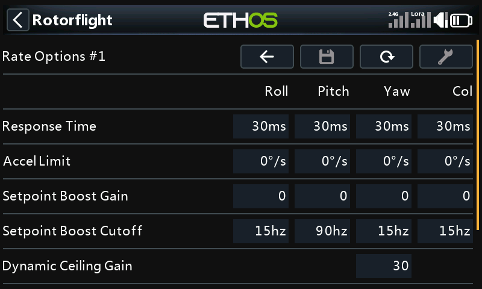

See [Rates](../../../../configurator/tabs/rates.mdx).
