# Setup

**Setup** covers how the helicopter is built and wired: the board and radio,
the sensors, the mixer and servos, and power, motors and the governor. Each
section links to the page that explains the settings.

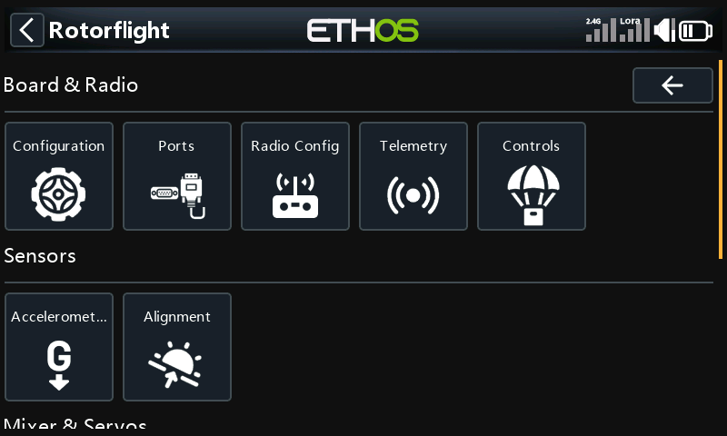

## Board & Radio

### Configuration

The craft name, PID loop speed, and the features the board runs: GPS, LED
strip and CMS.

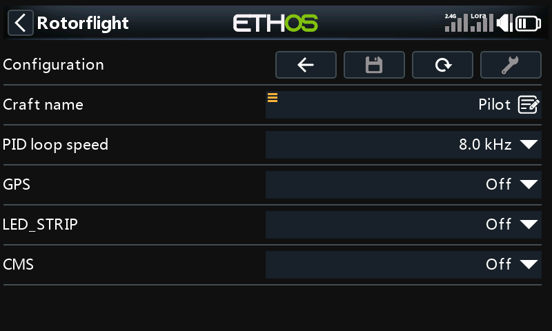

See [Configuration](../../../../configurator/tabs/configuration.mdx).

### Ports

What each UART is used for, and its speed.

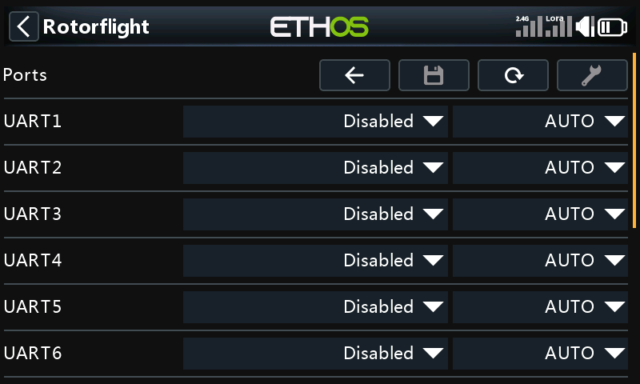

### Radio Config

Stick deflection and centre, the throttle range, and the yaw and cyclic
deadbands.

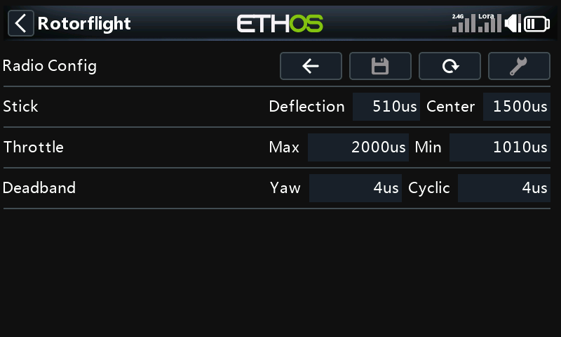

See [Receiver](../../../../configurator/tabs/receiver.mdx).

### Telemetry

The telemetry sensors the flight controller sends, grouped by kind. Open a
group to turn sensors on or off. **Tool** selects the default sensors.

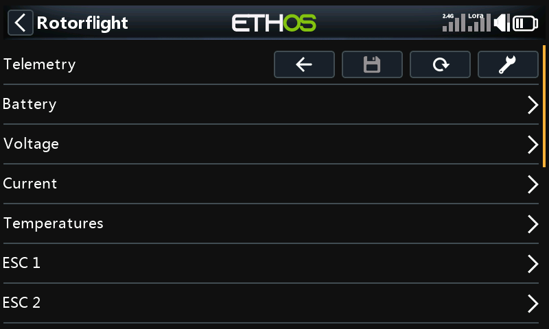

See [Receiver: Telemetry Sensors](../../../../configurator/tabs/receiver.mdx).

### Controls

A menu of its own:

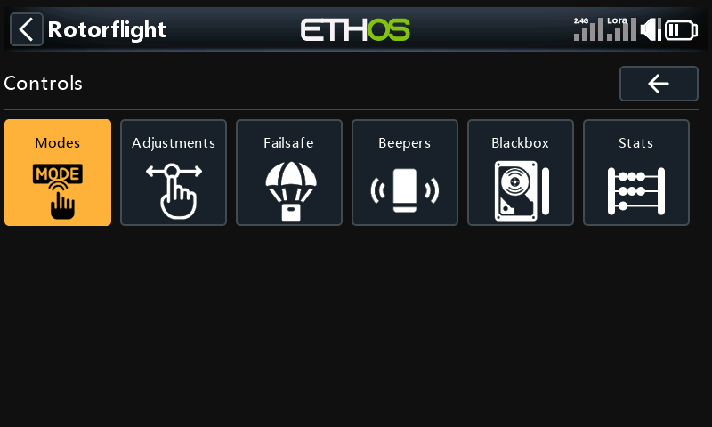

| Page | What it is for | More |
| --- | --- | --- |
| Modes | Switch ranges for each mode. Pick a mode, then add or change its ranges. | [Modes](../../../../configurator/tabs/modes.mdx) |
| Adjustments | In-flight adjustments from a switch or knob. | [Adjustments](../../../../configurator/tabs/adjustments.mdx) |
| Failsafe | What each channel does when the signal is lost. | [Failsafe](../../../../configurator/tabs/failsafe.mdx) |
| Beepers | Which events sound the beeper, and the ESC beacon. | [Beepers](../../../../configurator/tabs/beepers.mdx) |
| Blackbox | The logging device, rate and fields, and the log memory's status. **Tool** on _Status_ erases it. | [Blackbox](../../../../configurator/tabs/blackbox.mdx) |
| Stats | Flight count, and last and total flight time. | |

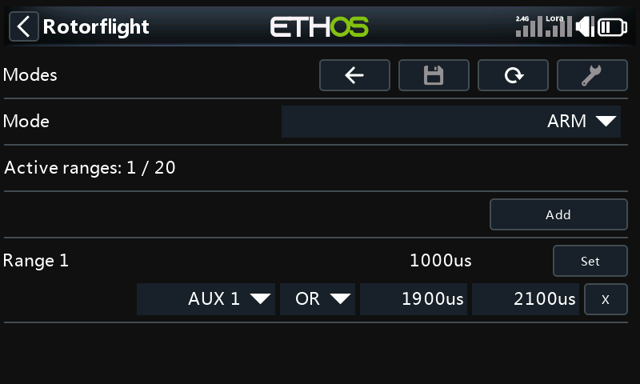

## Sensors

### Accelerometer

Accelerometer trim for roll and pitch. **Tool** calibrates the
accelerometer: keep the model level and still while it does.

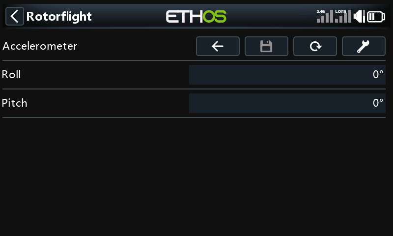

### Alignment

How the board is mounted, with a live 3D view of the helicopter that follows
the board as you move it. **Tool** turns the view so the tail faces you.

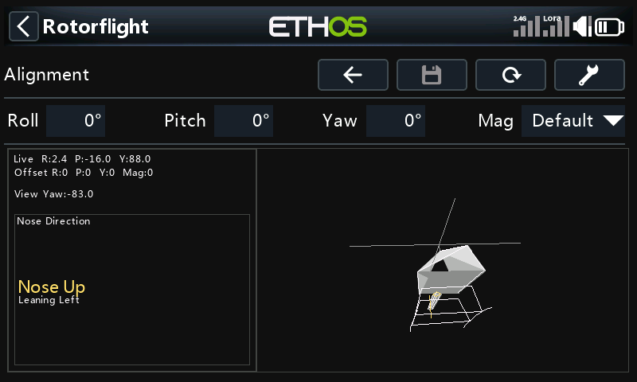

See [Configuration](../../../../configurator/tabs/configuration.mdx).

## Mixer & Servos

### Mixer

The swashplate and tail mixer, in four pages:

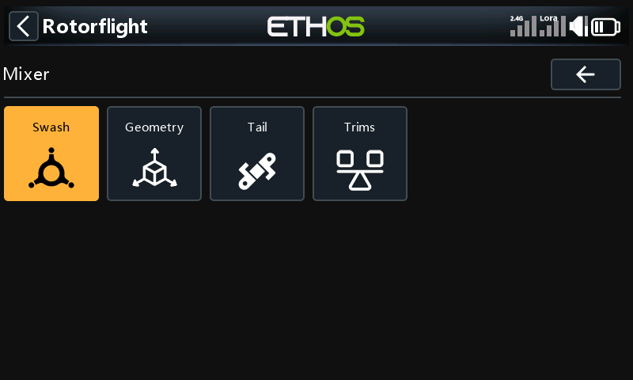

| Page | What it is for |
| --- | --- |
| Swash | Swash type, rotor direction, and the aileron, elevator and collective directions. |
| Geometry | Cyclic and collective calibration, geometry correction, and the pitch limits. **Tool** turns swash setup mode on, to level the swash. |
| Tail | Tail mode, yaw direction, tail idle and centre offset, and yaw trim and calibration. |
| Trims | Roll, pitch, collective and yaw trims. **Tool** turns mixer override on while you set them. |

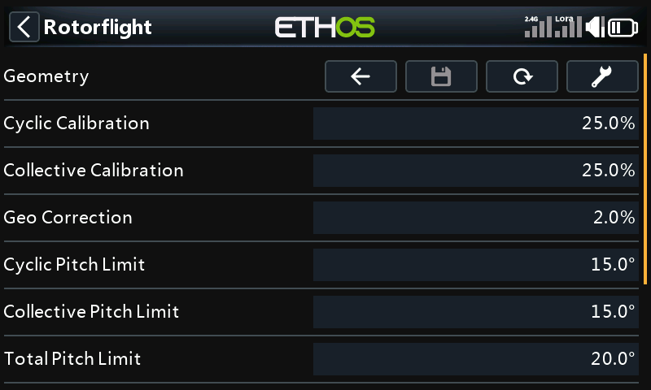

See [Mixer](../../../../configurator/tabs/mixer.mdx) and
[Setup Mixer](../../../setup-mixer.mdx).

### Servos

**PWM Output** lists the servos; select one to set its centre, limits and
direction. **BUS Output** is for bus servos and is greyed out unless the
model has them. **Tool** turns servo override on, so a servo moves to its
centre as you change it.

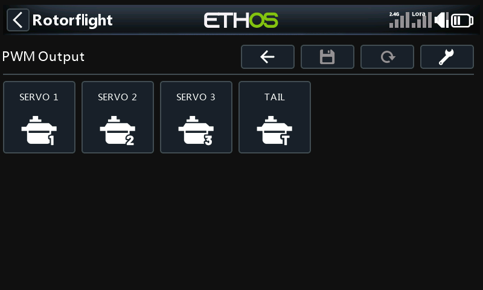

See [Servos](../../../../configurator/tabs/servos.mdx).

## Power & Motors

### Power

| Page | What it is for |
| --- | --- |
| Battery | Battery profiles: capacity and cell voltages. |
| Alerts | Flight time alarm and the BEC and receiver voltage alerts. |
| Sources | Where voltage and current are measured. |
| SmartFuel | How fuel (charge left) is worked out. |

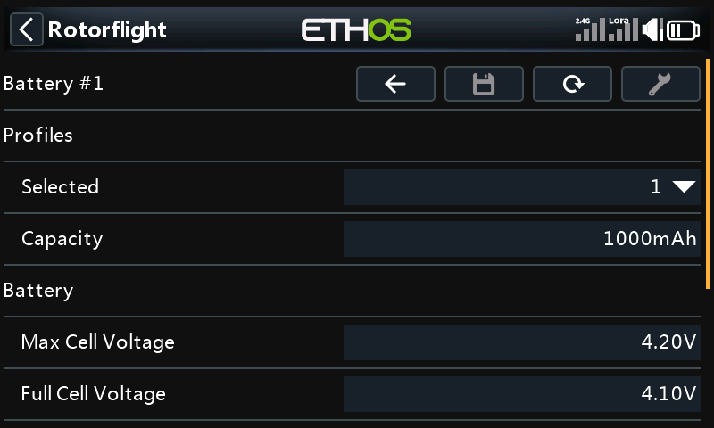

See [Power](../../../../configurator/tabs/power.mdx).

### ESC & Motors

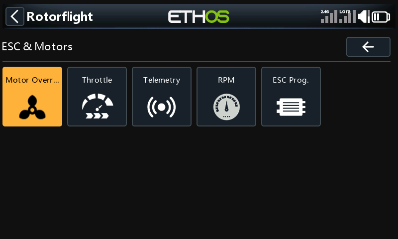

| Page | What it is for | More |
| --- | --- | --- |
| Motor Override | Run the motor from the radio, for testing. Take the blades off and secure the helicopter first. | |
| Throttle | Throttle protocol, update rate and PWM endpoints. | [Motors](../../../../configurator/tabs/motors.mdx) |
| Telemetry | ESC telemetry protocol and corrections. | [ESC Telemetry](../../../esc-telemetry.mdx) |
| RPM | Where RPM comes from, the main and tail motor gear ratios and the pole count. | [RPM Measurement](../../../rpm-measurement.mdx) |
| ESC Prog. | Change your ESC's own settings from the radio, through the flight controller. Pick the ESC's make. | [ESC Forward Programming](../../../esc-forward-programming.mdx) |

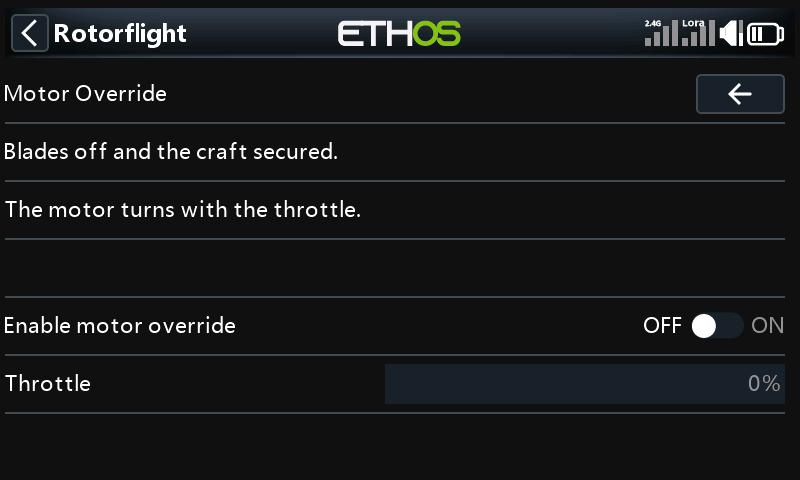

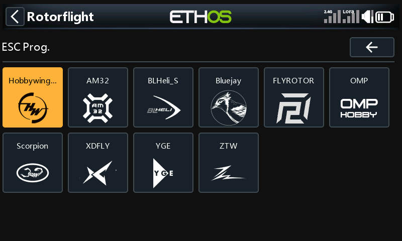

Each ESC page shows the ESC it found, then its settings in groups:

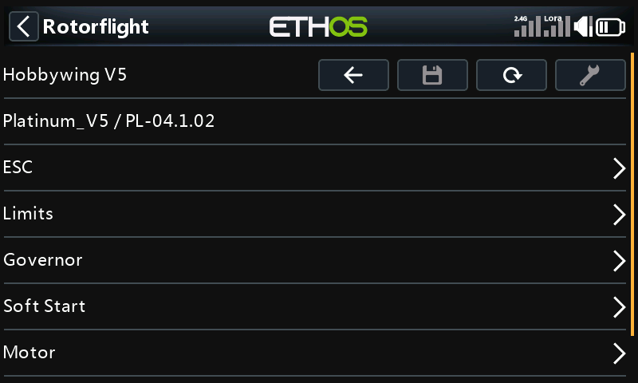

### Governor

The governor's mode and timing, in four pages. Its per-profile settings
(head speed and gains) are under
[Flight Tuning → Governor](./flight-tuning.md#governor).

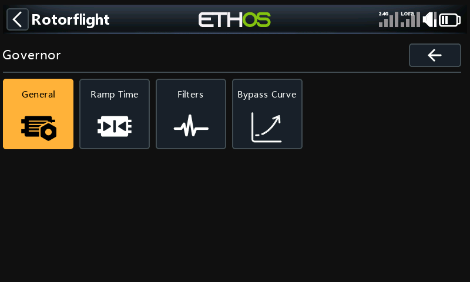

| Page | What it is for |
| --- | --- |
| General | Governor mode, throttle type, idle and auto throttle, handover throttle and the throttle hold timeout. |
| Ramp Time | Startup, spoolup, spooldown, tracking and recovery times. |
| Filters | Head speed and voltage filter cutoffs, TTA and precomp bandwidth, and the D-term cutoff. |
| Bypass Curve | The throttle curve used when the governor is bypassed. |

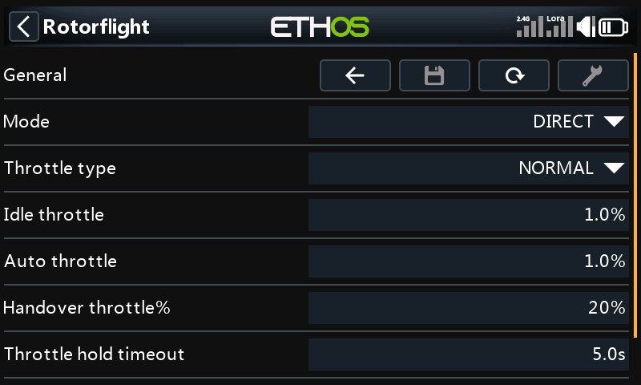

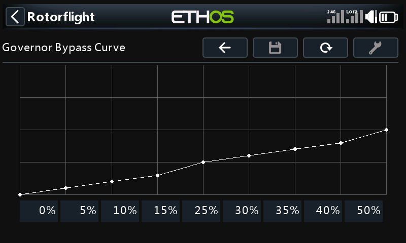

See [Governor](../../../../configurator/tabs/governor.mdx).
