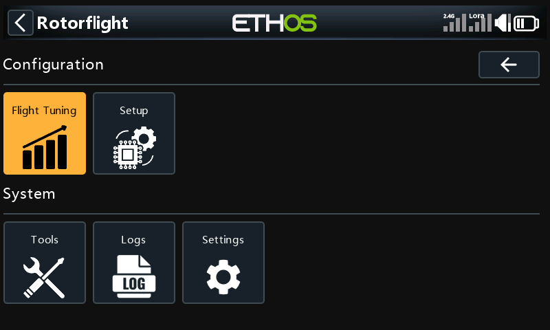
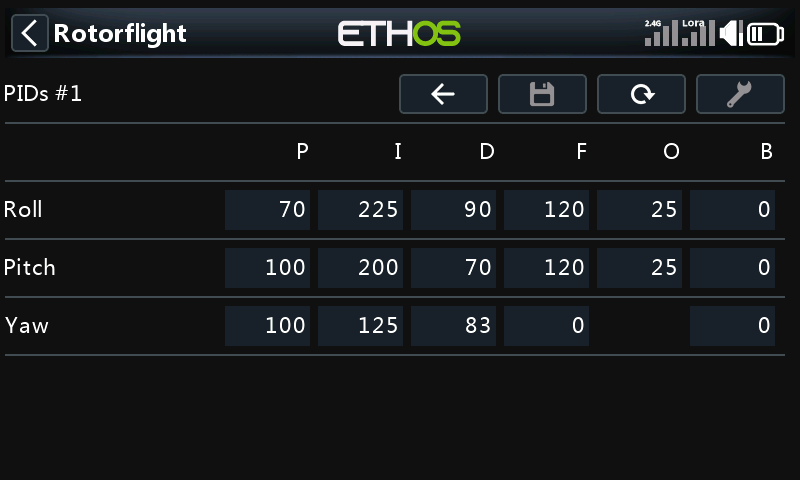
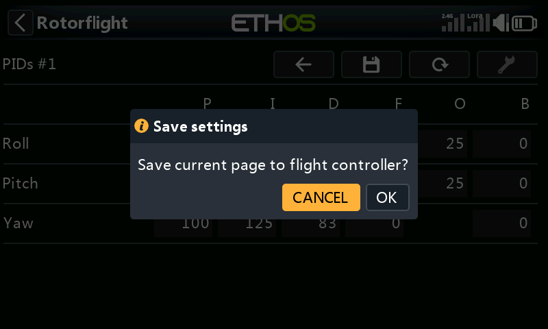

# Using the App

## Menus

The app opens on its main menu. Every menu is a grid of tiles, sorted under
headings. A tile either opens another menu or a settings page.

You can use the touchscreen, or the rotary encoder: turn it to move between
tiles and press it to open one. When you go back to a menu, the tile you last
opened is still selected.

Tiles stay greyed out until the radio is talking to the flight controller.
**Logs** and **Settings** are the exception: they are stored on the radio,
so they work with the model switched off.

## The header

Every screen has a header row: the page's title on the left and its buttons
on the right.

| Button | What it does |
| --- | --- |
|  **Back** | Goes back to the previous menu. RTN on the radio does the same. |
|  **Save** | Writes the page to the flight controller. |
|  **Reload** | Reads the page from the flight controller again, discarding changes you have not saved. |
|  **Tool** | The page's own extra action, where it has one (see below). |

Menus show only the **Back** button. On a settings page all four are there,
but a button is greyed out when it can't be used. For example, **Tool** is
grey on pages that have no extra action.

Pages that belong to a profile show its number in the title, such as
_PIDs #1_. The number follows the profile the flight controller is using, so
if you switch profiles from the radio, the page follows.

A long title loses its leading parts to fit, for example
_... / ESC temp_ instead of _Settings / Audio / ESC temp_ on a small screen.

## Changing and saving settings

1. Open a page. The suite reads it from the flight controller; a _Loading_
   dialog shows while it does.
2. Change a value: tap it, or select it with the encoder and press, then
   turn.
3. Press **Save**. It only lights up once you have changed something.
4. Confirm _Save current page to flight controller?_

The flight controller keeps the change for good once it is saved. If you
would rather not be asked each time, turn the save and reload prompts off
under [Settings → General → Safety Prompts](./settings.md#general).

:::warning[Saving while armed]

**Save** is greyed out while the model is armed. If the flight controller
refuses a save because the model armed while it was being sent, a red banner
says _Save not committed_: your changes are kept and written as soon as you
disarm.

:::

Use **Reload** to throw away changes you haven't saved. It asks
_Reload data from flight controller?_ first.

## The Tool button

These pages have an extra action behind **Tool**:

| Page | Tool does |
| --- | --- |
| Accelerometer | Calibrates the accelerometer. Keep the model level and still. |
| Alignment | Turns the 3D view so the tail faces you. |
| Telemetry | Selects the default telemetry sensors. |
| Mixer: Geometry | Turns swash setup mode on or off, so you can level the swash. Turn it off to give mixer control back to the flight controller. |
| Mixer: Trims | Turns mixer override on or off, for setting the trims. Turn it off to give the servos back to the flight controller. |
| Servos | Turns servo override on or off. While it is on, a servo's centre moves as you change it, so you can trim it by eye. |
| Blackbox Status | Erases the onboard log memory. |
| Tune Advisor | Clears the flight data the advisor has collected. |

Each one asks before it does anything.
