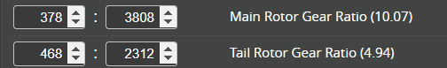
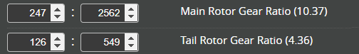

# Two-Stage Gear Train Ratios

Having an accurate gear ratio for the main and tail rotor is essential for Rotorflight accurate RPM Filters performance.

Therefore it is best to count the tooth on the main and tail gear/pulley reduction sets and enter the values into the configurator.

This is relatively easy in single stage drive train that are used on most helicopters.

Broadly there are three types of two-stage ratios which are dependent on where the tail gear is connected. Review your helicopters gear arrangement and choose the calculator that matches below.

!!! warning "note"
    Select the helicopter from the dropdown or count the gear teeth for your helicopter and enter the count into the calculator.

## Type 1 - Two-stage gears

Many SAB and ALIGN helicopters use this method.

Chose your helicopter and modify the motor pinion to match what you are installing.

| Helicopter | Z1 | Z2 | Z3 | Z4 | Z5 | Z6 | Main Ratio | Tail Ratio |
| --- | --- | --- | --- | --- | --- | --- | --- | --- |
| SAB Goblin 500 Sport | 18 | 48 | 18 | 62 | 28 | 21 | 27:248 | 27:124 |
| SAB Black Thunder 700 | 21 | 60 | 19 | 68 | 37 | 26 | 133:1360 | 247:1258 |
| SAB Kraken 580 | 22 | 50 | 14 | 58 | 27 | 23 | 77:725 | 161:783 |
| SAB Kraken 700 | 21 | 56 | 18 | 69 | 34 | 27 | 9:92 | 81:391 |
| SAB Raw 580 | 22 | 50 | 14 | 58 | 27 | 23 | 77:725 | 161:783 |
| SAB Raw 580 Nitro | 26 | 50 | 14 | 58 | 27 | 23 | 91:725 | 161:783 |
| SAB Raw 700 | 21 | 56 | 18 | 69 | 34 | 26 | 9:92 | 78:391 |
| SAB Raw 700 Nitro | 27 | 52 | 14 | 58 | 27 | 22 | 189:1508 | 154:783 |
| SAB Raw 700 Piuma | 20 | 52 | 14 | 58 | 27 | 22 | 35:377 | 154:783 |
| SAB ilGoblin 700 | 21 | 56 | 18 | 68 | 34 | 26 | 27:272 | 117:578 |
| SAB ilGoblin 700 SUT | 21 | 56 | 18 | 68 | 34 | 25 | 27:272 | 225:1156 |
| ALIGN TB40 Top Combo | 21 | 40 | 13 | 46 | 25 | 22 | 273:1840 | 143:575 |
| ALIGN TB60 Top Combo | 21 | 44 | 15 | 62 | 27 | 23 | 315:2728 | 115:558 |
| ALIGN TB60 Super Combo | 21 | 44 | 15 | 62 | 28 | 23 | 315:2728 | 345:1736 |
| ALIGN TB70 Top Combo | 21 | 50 | 15 | 62 | 27 | 23 | 63:620 | 115:558 |
| ALIGN TB70 Super Combo | 21 | 50 | 15 | 62 | 28 | 23 | 63:620 | 345:1736 |

## Type 2 - Two-stage gears

Chose your helicopter and modify the motor pinion to match what you are installing.

| Helicopter | Z1 | Z2 | Z3 | Z4 | Z5 | Z6 | Main Ratio | Tail Ratio |
| --- | --- | --- | --- | --- | --- | --- | --- | --- |
| KDS Agile A5 | 21 | 54 | 17 | 66 | 57 | 14 | 119:1188 | 14:57 |
| KDS Agile 7.2 | 21 | 54 | 20 | 66 | 57 | 12 | 35:297 | 4:19 |
| KDS Agile A7 | 21 | 54 | 20 | 66 | 57 | 12 | 35:297 | 4:19 |
| Align TN70 | 27 | 30 | 16 | 107 | 102 | 23 | 72:535 | 23:102 |

## Type 3 - Two-stage gears

This gear system was used for the Gaui Hurricane.

| Helicopter | Z1 | Z2 | Z3 | Z4 | Z5 | Z6 | Z7 | Main Ratio | Tail Ratio |
| --- | --- | --- | --- | --- | --- | --- | --- | --- | --- |
| Gaui Hurricane | 13 | 42 | 19 | 61 | 14 | 9 | 9 | 247:2562 | 14:61 |

## Calculations

The following section is an example for the calculations that are used in the above. This can be used if you wish to know more or to calculate the ratios yourself.

### Type 1

For example for the SAB ilGoblin 700 with STD 21T motor pulley, the calculation will be as follow:

**SAB ilGoblin 700**

**z1:**  21 teeth\
**z2:**  56 teeth\
**z3:**  18 teeth\
**z4:**  68 teeth\
**z5:**  34 teeth\
**z6:**  26 teeth

* `motor pinion` = *(Z1 x Z3)* = *(21 x 18)* = `378`.
* `main gear` = *(Z2 x Z4)* = *(56 x 69)* = `3808`.
* `tail pulley` = *(Z3 x Z6)* = *(18 x 26)* = `468`.
* `front pulley` = *(Z4 x Z5)* = *(69 x 34)* = `2312`.

### Type 2

For example for the KDS Agile A5 with STD 21T motor pulley, the calculation will be as follow:

**KDS Agile A5**

**z1:**  21 teeth\
**z2:**  54 teeth\
**z3:**  17 teeth\
**z4:**  66 teeth\
**z5:**  57 teeth\
**z6:**  14 teeth

* `motor pinion` = *(Z1 x Z3)* = *(21 x 17)* = `357`.
* `main gear` = *(Z2 x Z4)* = *(54 x 66)* = `3564`.
* `tail pulley` = *(Z6)* = *(14)* = `14`.
* `front pulley` = *(Z5)* = *(57)* = `57`.

### Type 3

This gear train type has a two-stage Main rotor and two-stage tail ratios. This design was used for helicopters such as the Gaui Hurricane.

**Gaui Hurricane**

**z1:**  13 teeth\
**z2:**  42 teeth\
**z3:**  19 teeth\
**z4:**  61 teeth\
**z5:**  14 teeth\
**z6:**  9 teeth\
**z7:**  9 teeth

* `motor pinion` = *(Z1 x Z3)* = *(13 x 19)* = `247`.
* `main gear` = *(Z2 x Z4)* = *(42 x 61)* = `2562`.
* `tail pulley` = *(Z5 x Z7)* = *(14 x 9)* = `126`.
* `front pulley` = *(z4*z6)\* = *(61 x 9)* = `549`.

