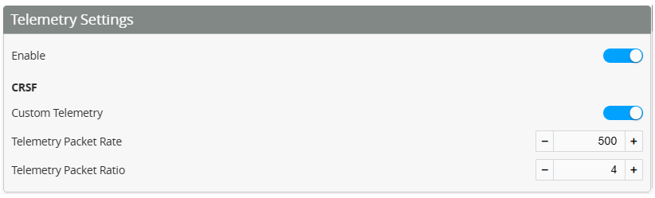

import Tabs from '@theme/Tabs';
import TabItem from '@theme/TabItem';
import tabStyles from '../tabs.module.css';

import EdgeTX from './img/edgetx-logo.png';
import ETHOS from './img/ethos-logo.png';

# ELRS Custom Telemetry

:::danger[ELRS Version]
There is a bug in ELRS prior to 3.5.5 that can lead to loss of control.\
***We recommend upgrading your ELRS to 3.5.5 or higher.***

If you are using earlier versions we would recommend NOT to use third party widgets that are using MSP in flight AND.

* Use Hybrid Switch Mode,
* Use Telem Ratio 1:2 or 1:4
:::

## Why Custom Telemetry

The ELRS (**which uses the Crossfire protocol**) has a limited array of parameters that can be transferred. Many of these values are not very applicable to a helicopter (as opposed to drones). Other values such as headspeed (quite important for our helicopters) are not available. In Rotorflight 2.0 returning some of our more important parameters back to the Tx was achieved by ELRS Telemetry Reuse however, this was also limited.

Custom telemetry has been implemented for ELRS in Rotorflight 2.1. This allows many more sensors that was previously not possible with CRSF. Currently there are over 100 sensors to choose from, and a maximum of 40 sensors can be used in total. With the ELRS configurable telemetry ratio, the sensors can be updated up to 20 times per second.

***Note: ‘Telemetry Reuse’ (from Rotorflight 2) has been removed as it is no longer required***

### 1. Enable CRSF custom telemetry

To set up ELRS custom telemetry:

* Enable telemetry (This enables telemetry for all receiver types)
* CRSF Custom Telemetry (This enables the ELRS custom)\
  This is located under the Receiver tab in Rotorflight Configurator.
* Set the Telemetry rate. We recommend 1000
* Set the Telemetry ratio. Generally this can be between **4 and 16**
  * Note Please read the warning at the top of page. Update to ELRS 3.5.5
  * Start with 4. If you get 'telemetry lost' then increase as required.

### 2. Choose Sensors

Next, select the sensors you want enabled. Open each group (battery, voltage current, temperature etc). Enable each parameter you wish to be visible on your transmitter.

:::info[Please choose to suit your Radio - EdgeTX or ETHOS]
<Tabs groupId="operating-systems">
  <TabItem value="" label="Choose Tx" default attributes={{className: tabStyles.tab}}>
    Rotorflight has great support for both EdgeTX and Ethos.  Please choose your radio.
  </TabItem>

  <TabItem value="EdgeTX" label="EdgeTX" attributes={{className: tabStyles.tab}}>
    ## EdgeTX

    

    ### 3. Set ELRS Packet rate

    Set ‘Telemetry Rate’ to match the ‘Packet Rate’ you’ve set for ELRS (500 in the example below). Then set ‘Telemetry Ratio’ to match the ‘Telem Ratio’ you’ve set in ELRS (4 in the example below). The screenshot below is from Express LRS Lua script’s main screen

    

    ### 4. Download telemetry Lua Script

    NOTE! Lua script is required for Custom Telemetry
    Custom telemetry requires the radio to run a telemetry Lua script in the background. You need to install all the Lua scripts coming with the release, and then enable rf2tlm.lua as a ‘Custom Script’ in your EdgeTx model. The steps below explain how to to this and discover the newly added sensors on your EdgeTx radio.

    [**Download the latest Lua script HERE**](https://github.com/rotorflight/rotorflight-lua-scripts/releases)

    

    ### 5. Add Lua to SD card

    2. Copy the ‘Script’ folder from the zip file into your EdgeTx radio’s SD card (root directory). There will be a Scripts folder already in your SD card. You can safely overwrite any existing files. (Note: As with any upgrades, ensure you have already backed up your SD card in case anything goes wrong)
       Contents of the zip file:

    

    Contents of your SD card should look something like this:\
    

    ### 6. Enable Background Scripts on Tx

    

    

    ### 7. Discover telemetry

    * Power off your Flight Controller.
    * On your EdgeTx radio, navigate to Model settings -> Telemetry page and **Delete All** sensors that you may have previously discovered. Then **Discover New** sensors
    * NOW power up your helicopter for sensors to be discovered

    ***Important: If your sensors are not in the correct order it means the FC was already powered prior to "Discover new". Make sure the FC is powered up only after "Discovery new" is active***

    
  </TabItem>

  <TabItem value="ETHOS" label="ETHOS" attributes={{className: tabStyles.tab}}>
    ## ETHOS

    

    ### 3. Open Rotorflight on Tx

    

    ### 4. Configure the external module

    Chose ELRS protocol on your external module

    

    ### 5. Setup Tx

    Set the Packet rate and telemetry ratio to match what has been configured in the Flight controller in step 1.

    

    ### 6. Enable RF custom Lua

    Exit the Tx screen and navigate to the Lua icon. Select and enable the Rotorflight background task.

    

    

    ### 7. Telemetry

    Navigate to the telemetry page

    

    ### 8. Sensors

    Discover new sensors.

    
  </TabItem>
</Tabs>
:::
