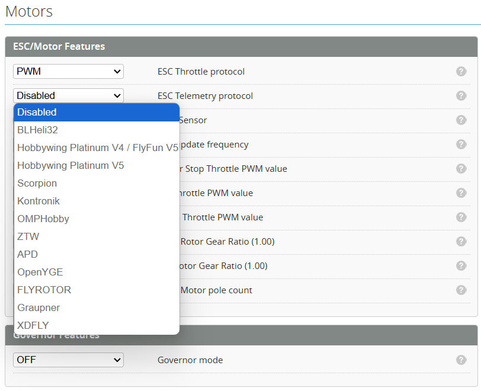
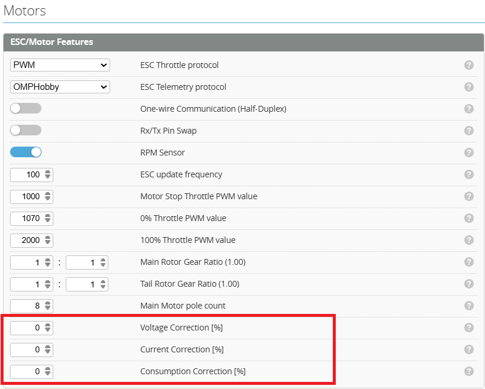
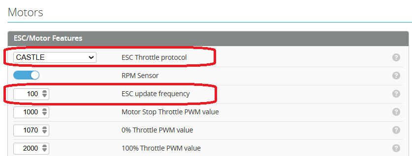
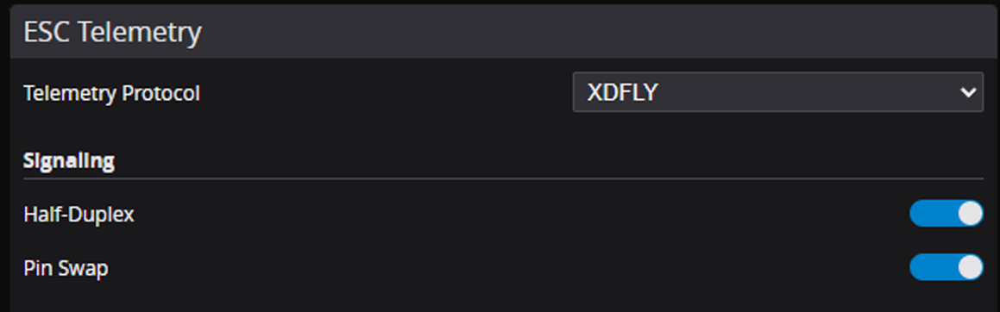

# ESC Telemetry

:::info
The purpose of ESC telemetry is to provide a method of reading the values provided by the ESC. These are things such as RPM, Temperature, Voltage, Current and mAh consumed. This is accomplished by connecting the ESC telemetry wire to the flight controller with a spare UART.

ESC Telemetry currently supported are :

* **BLHELI32**: BLheli and KISS
* **HOBBYWING V4**: Platinum PRO V4, V4.1,& FLYFUN V5
* **HOBBYWING V5**: Platinum V5
* **SCORPION**: Unsc Telem
* **KONTRONIK**: Kosmik & Kolibri
* **OMPHOBBY**
* **ZTW**: Skyhawk
* **APD**: HV Pro UART telemetry
* **FlyRotor**:
* **Graupner**:
* **YGE**: OpenYGE - Note - The ESC must have firmware V1.03547 or above. At the moment this is in beta and has not been released. Please use the contact form to request the updated firmware. [YGE: Contact Us](https://www.yge.de/en/contact/)
* **XDFLY**:
:::

:::caution
Looking for **Castle Creations** Telemetry?. Castle ESCs use a single wire protocol which is quite different to normal ESC telemetry. see the [**Castle ESC Telemetry**](#castle-esc-telemetry) below.
:::

### Select Serial Port

The ESC telemetry pin TX needs to be connected to a spare UART RX.

Select the UART from the Configuration page.

### Select the Protocol

Select the correct ESC telemetry protocol based on the one you are using.

### Power Config

Enable the Voltage and Current from the `Power` Tab.

### Calibrate telemetry values

The measurement accuracy of some ESCs is poor and may need to be scaled to obtain more reasonable values (Some Hobbywing ESCs are very bad). These can be calibrated by using the correction correction factors shown below.

## Castle ESC Telemetry

Castle ESCs use a single wire protocol. As such the signal and telemetry are sent on the same wire.

### Set ESC Protocol

In the **Motor Protocol** select Castle.

### Enable ESC Link Live

Enable **Link Live** using the Castle link software connected to your ESC.

### DIY Castle link

This adapter connects between the ESC and the FC. It can be made from a small piece of perf board and a resistor. This resistor is sized depending on your BEC voltage.

5v BEC      = 5k Resistor\
7.4v BEC    = 8.2k Resistor\
9.6v BEC    = 13k Resistor\
12v BEC     = 18k Resistor

They can be soldered directly to the perf board as below.

## HOBBYWING (V4/V5) Telemetry

To avoid interferences or destructive voltages it's important to remove the red wire.

## xdfly telemetry setup

### Connect ESC

Connect the RX pin of the ESC to a UART port of the flight controller. Using TLM or SBUS is most convenient.
A GND connection is optional. Make sure not to connect the + pin of the ESC's telemetry port.\

### Setup Ports

Set up the UART ports in the configuration panel. Make sure to match the connection from step 1.\

### Battery Settings

Now you need to set the battery info to grab the information from the ESC telemetry:
Go to the Battery panel and adjust the settings as shown.\

### Telemetry Configuration

To enable telemetry data from the ESC, you need to configure the telemetry settings:
1 / 2
xdfly\_telemetry\_setup.md
2026-01-25
Set the telemetry protocol to "XDFLY", and enable half-duplex and pin swap. Half-duplex is required since we
are using UART with only one wire for RX and TX. Pin swap is needed because the TLM and SBUS are
connected to an RX pin of the MCU. The default half-duplex configuration uses a TX pin, so we need to swap
the pins.\

### Test

The ESC and the flight controller should now be able to communicate. The FC and ESC perform a handshake
at power-up. Having your flight controller powered on (for example via USB) and powering the ESC afterwards
won't work. Power up both at the same time to establish a successful connection. You should now see voltage
and current values from the ESC in the motor panel.

:::note
For using ESC forward programming it is necessary to use the RX pin of the ESC telemetry port
:::
