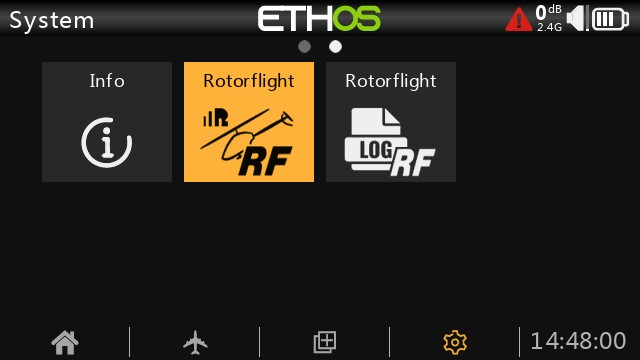
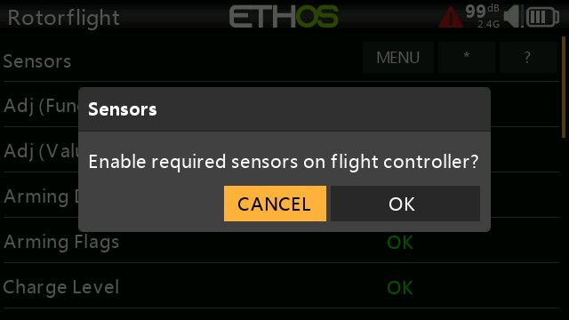

# FrSky Ethos Missing Sensors 

:::info[Ethos Missing Sensors]
This guide will help with the error shown below: This error is shown where the Ethos Suite LUA is not receiving a sensor(s) from the FBL it requires to operate.
:::

Press the [SYS] key and scroll to the Rotorflight LUA, enter the LUA

Scroll to the sensors tab and enter.

An image similar to this will appear showing a missing sensor or sensors.

Highlight and press the * icon at the top

The flight controller will resart after the changes are applied.

NOTE: If the * option is not available you will be required to upgrade your Rotorflight firmware to at least RC1 or add the sensors manualy in the receiver \ telemetry options, delete all and re-discover sensors.

You can as a short cut, if so desired, enter this in the cli then enter save.

set telemetry_sensors = 3,5,6,15,18,23,52,60,90,91,93,95,96,99,0,0,0,0,0,0,0,0,0,0,0,0,0,0,0,0,0,0,0,0,0,0,0,0,0,0

Again, delete and re-discover sensors

NOTE: At this point its good practice to re-start the radio to remove any cache values previously stored.